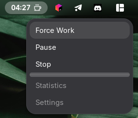

# Pomodoro Timer - GNOME Shell Extension


A clean and efficient Pomodoro Timer extension for GNOME Shell, helping you boost productivity with the time-tested Pomodoro Technique.

> **Note:** This is my first open source and GNOME Shell extension project ❤️ Feedback and contributions are welcome!

## Features
- ⏱️ Classic Pomodoro Timer: 25-minute work sessions, 5-minute breaks
- 🎯 Smart State Management: Tracks work, break, pause, and overtime states
- 🔔 Desktop Notifications: Get notified when sessions complete
- ⏸️ Pause/Resume: Full control over your timer
- 💫 Visual Feedback: Animated panel indicator with blinking effects
- 🎨 Clean UI: Minimal and distraction-free design
- ⚡ Lightweight: Efficient resource usage

### Screenshots




## Requirements

- GNOME Shell 45, 46, 47, 48, or 49
- Linux distribution with GNOME desktop environment

## Installation

From Source (Recommended for Development)

```bash
  # Clone the repository
  git clone https://github.com/vlad-vorobei/pomodoro-timer
  cd pomodoro-timer
```
```bash
  # Quick install (recommended)
  bash install.sh 
```
```bash
  # Manual installation
  mkdir -p ~/.local/share/gnome-shell/extensions/pomodoro-timer@vladvorobei
  cp -r extension.js metadata.json stylesheet.css src/ icons/ \
    ~/.local/share/gnome-shell/extensions/pomodoro-timer@vladvorobei/
```
```bash
  # Enable the extension
  gnome-extensions enable pomodoro-timer@vladvorobei
  
  # Restart GNOME Shell
  # On X11: Press Alt+F2, type 'r', press Enter
  # On Wayland: Log out and log back in
  ## From GNOME Extensions Website
```

## From GNOME Extensions Website 
Coming soon... (hope)

## Usage

### Basic Controls

| Action            | Description                    |
|-------------------|--------------------------------|
| Start Work        | Begin a 25-minute work session | 
| Start Break       | Begin a 5-minute break         |
| Pause             | Pause the current timer        |
| Resume            | Continue from where you paused |
| Stop              | Reset the timer completely     |
| Force Work/Break  | Switch timer type immediately  |

### Timer States
- STOP - Initial state, timer is inactive
- WORK - Active work session (25 min)
- BREAK - Active break session (5 min)
- PAUSE - Timer is paused
- WORK_COMPLETE - Work session finished (1 min grace period)
- BREAK_COMPLETE - Break finished (1 min grace period)
- WORK_OVERTIME - Working beyond scheduled time
- BREAK_OVERTIME - Break extended beyond scheduled time

### Panel Indicator

- Hourglass icon ⏳ - Work session
- Coffee icon ☕ - Break session
- Timer display - Shows remaining/elapsed time
- Blinking effect - Indicates active or completed sessions

## Architecture

```text
  pomodoro-timer/
  ├── src/
  │   ├── commands/          # Command pattern implementation
  │   │   └── TimerCommands.js
  │   ├── state/             # State management
  │   │   ├── StateManager.js
  │   │   └── timerStates.js
  │   ├── ui/                # User interface components
  │   │   ├── PanelIndicator.js
  │   │   ├── TimerDisplay.js
  │   │   └── MenuBuilder.js
  │   └── utils/             # Utility functions
  │       └── IconLoader.js
  ├── icons/                 # Custom SVG icons
  ├── extension.js           # Main extension entry point
  ├── metadata.json          # Extension metadata
  └── stylesheet.css         # Custom styles
```

## Design Patterns
 
- **Command Pattern**: Encapsulates timer actions as commands
- **State Pattern**: Manages timer states and transitions
- **Observer Pattern**: GObject signals for state changes
- **Factory Pattern**: Creates command instances dynamically

## Testing

```bash
# Run in nested GNOME session
dbus-run-session -- gnome-shell --nested --wayland

# Check logs
journalctl -f -o cat | grep "Pomodoro Timer"
```
## 🤝 Contributing

Contributions are welcome! Please feel free to submit a Pull Request.

1. Fork the repository
2. Create your feature branch (git checkout -b feature/AmazingFeature)
3. Commit your changes (git commit -m 'Add some AmazingFeature')
4. Push to the branch (git push origin feature/AmazingFeature)
5. Open a Pull Request

## Guidelines


- Follow the existing code style
- Add comments for complex logic
- Update documentation as needed
- Test on multiple GNOME Shell versions
- Ensure no memory leaks

## 📝 TODO


- Add settings preferences UI
- Implement session statistics tracking
- Add sound notifications
- Support custom work/break durations
- Add long break support (every 4 pomodoros)
- Implement daily/weekly reports
- Add keyboard shortcuts
- Add Do Not Disturb mode integration

## Known Issues

- Unicode characters in notifications may not display correctly
- Blinking animation may consume extra CPU on older hardware
- Timer state is not persisted across GNOME Shell restarts

## License

Copyright (C) 2025 Vladyslav Vorobei

This project is licensed under the GNU General Public License v3.0 - see the [LICENSE](LICENSE) file for details.

## Contact

Vladyslav Vorobei - https://github.com/vlad-vorobei - vladyslavvorobei@gmail.com

Project Link: https://github.com/vlad-vorobei/pomodoro-timer

 
> <p align="center">
>  Made with ❤️ for the GNOME community
> </p>